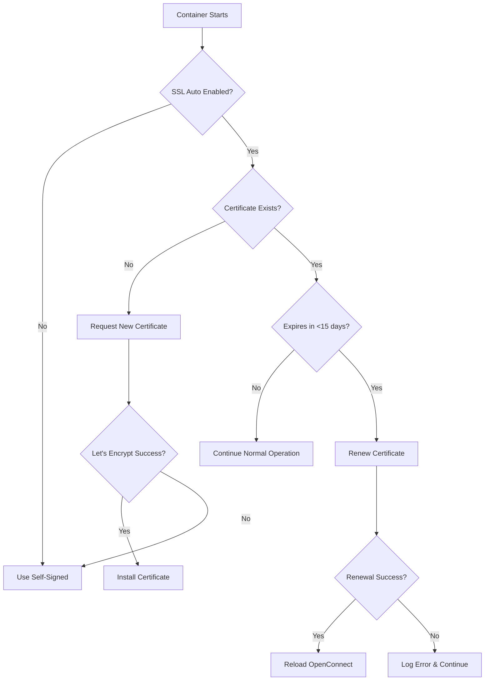

# OpenConnect VPN Server with Automatic SSL Management

[preview]: https://raw.githubusercontent.com/MarkusMcNugen/docker-templates/master/openconnect/ocserv-icon.png "Custom ocserv icon"

![alt text][preview]

## 🚀 Overview

OpenConnect VPN server is an SSL VPN server that is secure, small, fast and configurable. This **enhanced version** includes **automatic SSL certificate management** using acme.sh with Let's Encrypt, making it production-ready with minimal configuration.

**🆕 New in this version:**
- ✅ **Automatic SSL certificate generation and renewal**
- ✅ **Let's Encrypt integration with multiple challenge methods**
- ✅ **Periodic certificate monitoring (every 12 hours)**
- ✅ **Centralized volume management** - all files in `/etc/ocserv`
- ✅ **Production-ready logging and monitoring**
- ✅ **Self-signed certificate fallback**
- ✅ **Zero-downtime certificate renewal**

---

## 🌟 Key Features

### 🔐 SSL Certificate Management
- **Automatic certificate generation** using Let's Encrypt via acme.sh
- **Smart renewal logic** - renews certificates within 15 days of expiration
- **Multiple challenge methods**: HTTP standalone, DNS challenge, webroot
- **Automatic startup validation** - checks certificates on every container boot
- **Graceful fallback** to self-signed certificates if Let's Encrypt fails
- **Zero-downtime renewal** with automatic OpenConnect reload
- **Comprehensive logging** for troubleshooting

### 🐳 Enhanced Docker Features
- **Persistent configuration**: Single `/etc/ocserv` volume mount preserves everything
- **Centralized file management**: Configs, certificates, logs, and user data in one place
- **Flexible SSL configuration**: Support for custom domains and challenge methods
- **Production-ready**: Automatic certificate management with proper logging
- **Backward compatibility**: Works with existing OpenConnect configurations

### 🌐 Network Features
- **Full tunnel or split-tunnel** routing options
- **Customizable DNS servers** and split-DNS domains
- **Multiple authentication methods** (password, certificate, RADIUS)
- **Client compatibility**: OpenConnect and Cisco AnyConnect clients
- **IPv4 and IPv6 support**
- **Traffic compression** and optimization

---

## 🚀 Quick Start

### Method 1: Docker Compose (Recommended)

1. **Create docker-compose.yml**:
```yaml
version: '3.8'
services:
  openconnect:
    build: .
    container_name: openconnect-vpn
    privileged: true
    restart: unless-stopped
    ports:
      - "4443:4443/tcp"
      - "4443:4443/udp" 
      - "80:80/tcp"  # For Let's Encrypt HTTP challenge
    volumes:
      - ./ocserv-data:/etc/ocserv
    environment:
      - SSL_DOMAIN=vpn.yourdomain.com  # Change this!
      - ACME_STANDALONE=true
      - DNS_SERVERS=8.8.8.8,1.1.1.1
      - TUNNEL_MODE=all
```

2. **Start the service**:
```bash
docker-compose up -d
```

3. **Add users** (see User Management section below)

### Method 2: Docker Run Command

```bash
# Create data directory
mkdir -p ./ocserv-data

# Run with automatic SSL
docker run -d --privileged \
  --name openconnect-vpn \
  -p 4443:4443/tcp \
  -p 4443:4443/udp \
  -p 80:80/tcp \
  -v ./ocserv-data:/etc/ocserv \
  -e SSL_DOMAIN=vpn.yourdomain.com \
  -e ACME_STANDALONE=true \
  your-registry/openconnect-ssl
```

---

## 🔧 Configuration Guide

### Environment Variables

#### 🔐 SSL Certificate Management
| Variable | Required | Default | Description | Example |
|----------|----------|---------|-------------|---------|
| `SSL_DOMAIN` | ⚠️ Recommended | `vpn.example.com` | Domain name for SSL certificate | `vpn.yourdomain.com` |
| `ACME_STANDALONE` | No | `false` | Use HTTP standalone challenge (port 80) | `true` |
| `ACME_DNS_PROVIDER` | No | - | DNS provider for DNS challenge | `dns_cf` (Cloudflare) |
| `ACME_WEBROOT` | No | `/etc/ocserv/webroot` | Webroot path for HTTP challenge | `/var/www/html` |
| `DISABLE_SSL_AUTO` | No | `false` | Disable automatic SSL management | `true` |

#### 🌐 OpenConnect Server Settings
| Variable | Required | Default | Description | Example |
|----------|----------|---------|-------------|---------|
| `LISTEN_PORT` | No | `4443` | VPN listening port | `443` |
| `DNS_SERVERS` | No | Google/FreeDNS | Comma-delimited name servers | `8.8.8.8,1.1.1.1` |
| `TUNNEL_MODE` | No | `all` | Tunnel mode | `all` or `split-include` |
| `TUNNEL_ROUTES` | No | - | Routes for split tunneling | `192.168.1.0/24,10.0.0.0/16` |
| `SPLIT_DNS_DOMAINS` | No | - | Split-DNS domains | `local.com,corp.internal` |
| `POWER_USER` | No | `no` | Disable automatic config updates | `yes` |

### Volume Structure

When you mount `/etc/ocserv`, this directory structure is automatically created:

```
/etc/ocserv/                    # Main configuration directory
├── ocserv.conf                 # 📄 OpenConnect server configuration
├── ocpasswd                    # 👥 User password database
├── connect.sh                  # 🔌 Client connection script
├── disconnect.sh               # 🔌 Client disconnection script
├── certs/                      # 🔐 SSL certificates directory
│   ├── server-cert.pem         #     Server certificate
│   ├── server-key.pem          #     Server private key
│   └── ca.pem                  #     CA certificate (optional)
├── logs/                       # 📋 Log files directory
│   ├── ssl-manager.log         #     SSL management logs
│   └── ssl-check.log           #     Periodic SSL check logs
├── config-per-user/            # 👤 Per-user configurations
├── config-per-group/           # 👥 Per-group configurations
└── webroot/                    # 🌐 Webroot for HTTP challenge (if used)
```

---

## 🔐 SSL Certificate Management Guide

### Automatic Certificate Lifecycle

The container automatically manages SSL certificates through this process:



### SSL Challenge Methods

#### 1. 🌐 HTTP Standalone Challenge (Easiest)
**Best for**: Simple setups, single domain

```yaml
environment:
  - SSL_DOMAIN=vpn.yourdomain.com
  - ACME_STANDALONE=true
ports:
  - "80:80"  # Required for HTTP challenge
```

**Requirements**: Port 80 must be accessible from the internet

#### 2. 🔍 DNS Challenge (Most Flexible)
**Best for**: Wildcard certificates, behind firewall, multiple domains

**Cloudflare Example**:
```yaml
environment:
  - SSL_DOMAIN=vpn.yourdomain.com
  - ACME_DNS_PROVIDER=dns_cf
  - CF_Token=your_cloudflare_token
  - CF_Account_ID=your_account_id
```

**Other DNS Providers**:
- `dns_aws` (AWS Route53)
- `dns_gd` (GoDaddy) 
- `dns_he` (Hurricane Electric)
- See [acme.sh DNS providers](https://github.com/acmesh-official/acme.sh/wiki/dnsapi) for full list

#### 3. 📁 Webroot Challenge
**Best for**: Existing web server setup

```yaml
environment:
  - SSL_DOMAIN=vpn.yourdomain.com
  - ACME_WEBROOT=/var/www/html
volumes:
  - ./webroot:/var/www/html
```

### Manual SSL Certificate Management

#### Check Certificate Status
```bash
# Check current certificate
docker exec -it openconnect-vpn /usr/local/bin/ssl-manager.sh check

# View certificate details
docker exec -it openconnect-vpn openssl x509 -in /etc/ocserv/certs/server-cert.pem -text -noout
```

#### Force Certificate Renewal
```bash
# Force immediate renewal
docker exec -it openconnect-vpn /usr/local/bin/ssl-manager.sh force

# Generate self-signed certificate
docker exec -it openconnect-vpn /usr/local/bin/ssl-manager.sh self-signed
```

#### View SSL Logs
```bash
# SSL management logs
docker exec -it openconnect-vpn tail -f /etc/ocserv/logs/ssl-manager.log

# Periodic check logs  
docker exec -it openconnect-vpn tail -f /etc/ocserv/logs/ssl-check.log
```

---

## 👥 User Management Guide

### Adding Users

#### Method 1: Interactive (Recommended)
```bash
docker exec -it openconnect-vpn ocpasswd -c /etc/ocserv/ocpasswd username
# Enter password when prompted
```

#### Method 2: Batch Creation
```bash
# Create multiple users from file
echo "user1:password1" | docker exec -i openconnect-vpn sh -c 'IFS=: read u p; echo "$p" | ocpasswd -c /etc/ocserv/ocpasswd "$u"'
```

### Managing Users

```bash
# List all users
docker exec -it openconnect-vpn cat /etc/ocserv/ocpasswd

# Delete user
docker exec -it openconnect-vpn ocpasswd -c /etc/ocserv/ocpasswd -d username

# Change password
docker exec -it openconnect-vpn ocpasswd -c /etc/ocserv/ocpasswd username

# Lock user account (disable)
docker exec -it openconnect-vpn ocpasswd -c /etc/ocserv/ocpasswd -l username

# Unlock user account
docker exec -it openconnect-vpn ocpasswd -c /etc/ocserv/ocpasswd -u username
```

### User Connection Monitoring

```bash
# View active connections
docker exec -it openconnect-vpn occtl show users

# View connection statistics
docker exec -it openconnect-vpn occtl show stats

# Disconnect specific user
docker exec -it openconnect-vpn occtl disconnect user USERNAME
```

---

## 🛠️ Advanced Configuration

### Split Tunneling Setup

```yaml
services:
  openconnect-split:
    build: .
    container_name: openconnect-split
    privileged: true
    ports:
      - "4443:4443/tcp"
      - "4443:4443/udp"
      - "80:80"
    volumes:
      - ./ocserv-split-data:/etc/ocserv
    environment:
      # Split tunneling configuration
      - SSL_DOMAIN=vpn-split.yourdomain.com
      - TUNNEL_MODE=split-include
      - TUNNEL_ROUTES=192.168.1.0/24,10.0.0.0/16,172.16.0.0/12
      - SPLIT_DNS_DOMAINS=local.example.com,internal.corp
      - DNS_SERVERS=192.168.1.1,8.8.8.8
      - ACME_STANDALONE=true
```

### Custom Configuration (Power User Mode)

If you need full control over the OpenConnect configuration:

1. **Set Power User Mode**:
```yaml
environment:
  - POWER_USER=yes
  - SSL_DOMAIN=vpn.yourdomain.com  # SSL still works
```

2. **Create custom ocserv.conf**:
```bash
# Copy default config first
docker run --rm -v ./custom-config:/tmp your-image cat /etc/default/ocserv/ocserv.conf > ./custom-config/ocserv.conf

# Edit the configuration file
nano ./custom-config/ocserv.conf
```

3. **Mount custom configuration**:
```yaml
volumes:
  - ./custom-config:/etc/ocserv
```

### Per-User/Group Configurations

Create specific configurations for different users or groups:

```bash
# Create user-specific config
mkdir -p ./ocserv-data/config-per-user
cat > ./ocserv-data/config-per-user/john.conf << EOF
# John's specific configuration
route = 192.168.100.0/255.255.255.0
dns = 192.168.1.10
idle-timeout = 7200
EOF

# Create group-specific config  
mkdir -p ./ocserv-data/config-per-group
cat > ./ocserv-data/config-per-group/admins.conf << EOF
# Admin group configuration
no-route = 10.10.10.0/255.255.255.0
max-same-clients = 3
EOF
```

Then enable in main config:
```bash
# Add to ocserv.conf
config-per-user = /etc/ocserv/config-per-user/
config-per-group = /etc/ocserv/config-per-group/
```

---

## 📊 Monitoring and Logging

### Container Logs
```bash
# View container logs
docker logs -f openconnect-vpn

# View last 100 lines
docker logs --tail 100 openconnect-vpn
```

### SSL Certificate Monitoring
```bash
# Check certificate expiration
docker exec -it openconnect-vpn openssl x509 -in /etc/ocserv/certs/server-cert.pem -noout -dates

# View SSL management activity
docker exec -it openconnect-vpn tail -f /etc/ocserv/logs/ssl-manager.log

# Check periodic SSL validation
docker exec -it openconnect-vpn tail -f /etc/ocserv/logs/ssl-check.log
```

### Connection Monitoring
```bash
# Real-time connection monitoring
docker exec -it openconnect-vpn tail -f /var/log/messages | grep ocserv

# View connection statistics
docker exec -it openconnect-vpn occtl show stats

# Monitor user connections
watch 'docker exec -it openconnect-vpn occtl show users'
```

### Performance Monitoring
```bash
# Container resource usage
docker stats openconnect-vpn

# Network traffic
docker exec -it openconnect-vpn iftop -i vpns

# Disk usage of persistent volume
du -sh ./ocserv-data/
```

---

## 🔧 Troubleshooting Guide

### Common Issues and Solutions

#### 🚫 SSL Certificate Issues

**Problem**: Certificate validation fails
```bash
# Check domain DNS resolution
nslookup vpn.yourdomain.com

# Test certificate manually
docker exec -it openconnect-vpn /usr/local/bin/ssl-manager.sh force

# Check SSL logs for errors
docker exec -it openconnect-vpn tail -50 /etc/ocserv/logs/ssl-manager.log
```

**Problem**: Let's Encrypt rate limit hit
```bash
# Use staging environment for testing
docker exec -it openconnect-vpn sh -c 'export ACME_STAGING=1; /usr/local/bin/ssl-manager.sh force'
```

#### 🌐 Connection Issues

**Problem**: Can't connect to VPN
```bash
# Check if ports are open
netstat -tulpn | grep 4443

# Test connectivity
telnet your-server-ip 4443

# Check firewall settings
iptables -L -n | grep 4443
```

**Problem**: DNS not working through VPN
```bash
# Check DNS configuration
docker exec -it openconnect-vpn grep "^dns" /etc/ocserv/ocserv.conf

# Test DNS resolution
docker exec -it openconnect-vpn nslookup google.com
```

#### 🐳 Docker Issues

**Problem**: Container won't start
```bash
# Check container logs
docker logs openconnect-vpn

# Verify privileged mode
docker inspect openconnect-vpn | grep Privileged

# Check volume mounts
docker inspect openconnect-vpn | grep Mounts -A 10
```

### Debug Mode

Enable verbose logging for troubleshooting:

```yaml
environment:
  - DEBUG=true
  - ACME_DEBUG=1  # Enable acme.sh debug
command: ["ocserv", "-c", "/etc/ocserv/ocserv.conf", "-f", "-d", "1"]  # Debug level 1
```

---

## 🏗️ Building and Deployment

### Build from Source (Local Computer)

```bash
# Clone repository
git clone https://github.com/dnwk/docker-openconnect.git
cd docker-openconnect

# Build container locally
docker build -t openconnect-ssl .

# Test locally (optional)
docker run -d --privileged \
  --name openconnect-vpn \
  -p 4443:4443/tcp -p 4443:4443/udp -p 80:80 \
  -v ./ocserv-data:/etc/ocserv \
  -e SSL_DOMAIN=vpn.yourdomain.com \
  -e ACME_STANDALONE=true \
  openconnect-ssl
```

### Export and Upload to Registry

```bash
# Option 1: Push to Docker Hub
docker tag openconnect-ssl yourusername/openconnect-ssl:latest
docker push yourusername/openconnect-ssl:latest

# Option 2: Export as TAR file for offline transfer
docker save -o openconnect-ssl.tar openconnect-ssl:latest

# Option 3: Create multi-architecture build (recommended)
docker buildx create --name multiarch-builder --use
docker buildx build --platform linux/amd64,linux/arm64 \
  -t yourusername/openconnect-ssl:latest --push .
```

### MikroTik RouterOS Deployment

MikroTik RouterOS has limited Docker support through the Container package. Here's how to deploy with your existing `ocserv.conf`.

#### 📋 Prerequisites for MikroTik Deployment

```bash
# Check RouterOS version and architecture
/system resource print
/system license print

# Requirements:
# - RouterOS v7.4+ 
# - ARM64 or x86-64 architecture (not ARM32)
# - Container package installed
# - 2GB+ available storage
```

#### 🔧 Enable Container Support

```bash
# Enable container support (requires reboot)
/system device-mode update container=yes
/system reboot

# After reboot, verify container support
/container print
```

#### 🏗️ Method 1: Using Docker Hub Image

**Step 1: Build and Push Image (On your computer)**

```bash
# Build for MikroTik architecture
git clone https://github.com/dnwk/docker-openconnect.git
cd docker-openconnect

# Build multi-architecture image
docker buildx create --name mikrotik-builder --use
docker buildx build --platform linux/amd64,linux/arm64 \
  -t yourusername/openconnect-ssl:latest --push .
```

**Step 2: Deploy on MikroTik RouterOS**

```bash
# Create directories for persistent data
/file print
# Note: Use external storage (USB) for persistence
mkdir /usb1/ocserv-data
mkdir /usb1/ocserv-data/certs
mkdir /usb1/ocserv-data/logs

# Copy your existing ocserv.conf
# Upload via FTP/SFTP or copy from existing location
cp /your/existing/ocserv.conf /usb1/ocserv-data/ocserv.conf

# Update certificate paths in your config for container
# Edit /usb1/ocserv-data/ocserv.conf:
# server-cert = /etc/ocserv/certs/server-cert.pem
# server-key = /etc/ocserv/certs/server-key.pem
# auth = "plain[passwd=/etc/ocserv/ocpasswd]"

# Create container
/container
add remote-image=yourusername/openconnect-ssl:latest \
    interface=veth1 \
    root-dir=/usb1/container-root \
    logging=yes \
    hostname=mikrotik-vpn

# Configure environment variables
/container/envs
add name=POWER_USER value=yes key=mikrotik-vpn
add name=SSL_DOMAIN value=vpn.yourdomain.com key=mikrotik-vpn
add name=ACME_DNS_PROVIDER value=dns_cf key=mikrotik-vpn
add name=CF_Token value=your_cloudflare_token key=mikrotik-vpn

# Mount your configuration directory
/container/mounts
add dst=/etc/ocserv src=/usb1/ocserv-data key=mikrotik-vpn

# Configure container networking
/interface/veth
add address=172.17.0.2/24 gateway=172.17.0.1 name=veth1

/interface/bridge
add name=docker0

/interface/bridge/port
add bridge=docker0 interface=veth1

/ip/address
add address=172.17.0.1/24 interface=docker0

# Start container
/container/start mikrotik-vpn
```

#### 🏗️ Method 2: Build Locally and Transfer to RouterOS

This method is ideal when you want to build on your local computer and transfer to MikroTik without using Docker Hub.

**Step 1: Build Docker Image Locally**

```bash
# Clone the repository on your local computer
git clone https://github.com/dnwk/docker-openconnect.git
cd docker-openconnect

# Check your MikroTik architecture first (run on RouterOS):
# /system resource print
# Look for "architecture" field (x86-64, arm64, etc.)

# Build for x86-64 MikroTik (most common)
docker build --platform linux/amd64 -t openconnect-ssl:latest .

# Or build for ARM64 MikroTik
docker build --platform linux/arm64 -t openconnect-ssl:latest .

# Or build for both architectures (requires buildx)
docker buildx create --name multiarch --use
docker buildx build --platform linux/amd64,linux/arm64 \
  -t openconnect-ssl:latest --load .

# Verify the image was created
docker images | grep openconnect-ssl
```

**Step 2: Export Docker Image to TAR File**

```bash
# Export the built image to TAR file
docker save -o openconnect-ssl.tar openconnect-ssl:latest

# Check file size (should be ~200-300MB)
ls -lh openconnect-ssl.tar

# Optional: Compress to reduce transfer time
gzip openconnect-ssl.tar
# This creates openconnect-ssl.tar.gz (usually 50-70% smaller)

ls -lh openconnect-ssl.tar.gz
```

**Step 3: Transfer TAR File to MikroTik RouterOS**

Choose one of these transfer methods:

**Option A: SCP Transfer (Linux/Mac/Windows with SSH client)**
```bash
# Transfer compressed file via SCP
scp openconnect-ssl.tar.gz admin@192.168.1.1:/usb1/

# Or transfer uncompressed file
scp openconnect-ssl.tar admin@192.168.1.1:/usb1/
```

**Option B: SFTP Transfer**
```bash
# Connect via SFTP
sftp admin@192.168.1.1

# Navigate to USB storage
cd /usb1/

# Upload file
put openconnect-ssl.tar.gz

# Exit SFTP
exit
```

**Option C: WinBox File Transfer (Windows)**
1. Open WinBox and connect to your MikroTik
2. Go to **Files** tab
3. Navigate to **usb1** directory
4. Click **Upload** button
5. Select your `openconnect-ssl.tar.gz` file
6. Wait for upload to complete

**Option D: FTP Transfer**
```bash
# Enable FTP on RouterOS first (run on RouterOS):
# /ip service enable ftp

# Then upload via FTP from your computer
ftp 192.168.1.1
# Login with admin credentials
# Navigate and upload file
binary
cd usb1
put openconnect-ssl.tar.gz
quit
```

**Option E: HTTP Upload (if RouterOS has web interface enabled)**
1. Open web browser: `http://192.168.1.1`
2. Login with admin credentials  
3. Go to **Files** section
4. Navigate to **usb1**
5. Use upload function to transfer file

**Step 4: Load Image on RouterOS**

```bash
# Connect to RouterOS terminal (SSH/WinBox/Console)

# Navigate to where you uploaded the file
cd /usb1

# If you uploaded compressed file, decompress it first
gunzip openconnect-ssl.tar.gz

# Verify TAR file exists
ls -la openconnect-ssl.tar

# Import the Docker image into RouterOS container system
/container/import file=openconnect-ssl.tar

# Verify image was imported successfully
/container/config/print
# You should see openconnect-ssl:latest in the list

# Check image details
/container/config/print detail where repository="openconnect-ssl"
```

**Step 5: Deploy Container with Your Existing Config**

```bash
# Create directories for your configuration
mkdir /usb1/ocserv-data
mkdir /usb1/ocserv-data/certs
mkdir /usb1/ocserv-data/logs
mkdir /usb1/ocserv-data/config-per-user
mkdir /usb1/ocserv-data/config-per-group

# Copy your existing ocserv.conf (adjust path to your actual config location)
cp /flash/ocserv.conf /usb1/ocserv-data/ocserv.conf
# OR if stored elsewhere:
# cp /usb1/backup/ocserv.conf /usb1/ocserv-data/ocserv.conf

# Update certificate paths in your copied config file
# You can edit with RouterOS built-in editor or upload modified version
# Required changes in ocserv.conf:
# server-cert = /etc/ocserv/certs/server-cert.pem  
# server-key = /etc/ocserv/certs/server-key.pem
# auth = "plain[passwd=/etc/ocserv/ocpasswd]"
# default-domain = vpn.yourdomain.com

# Copy existing user database (if you have one)
cp /your/existing/ocpasswd /usb1/ocserv-data/ocpasswd
chmod 600 /usb1/ocserv-data/ocpasswd

# Create container using the imported image
/container
add remote-image=openconnect-ssl:latest \
    interface=veth1 \
    root-dir=/usb1/container-root \
    logging=yes \
    hostname=mikrotik-vpn

# Configure environment variables (POWER_USER=yes preserves your config)
/container/envs
add name=POWER_USER value=yes key=mikrotik-vpn
add name=SSL_DOMAIN value=vpn.yourdomain.com key=mikrotik-vpn
add name=ACME_DNS_PROVIDER value=dns_cf key=mikrotik-vpn
add name=CF_Token value=your_cloudflare_token key=mikrotik-vpn
add name=DISABLE_SSL_AUTO value=false key=mikrotik-vpn

# Mount your configuration directory
/container/mounts
add dst=/etc/ocserv src=/usb1/ocserv-data key=mikrotik-vpn

# Configure networking
/interface/veth
add address=172.17.0.2/24 gateway=172.17.0.1 name=veth1

/interface/bridge  
add name=docker0

/interface/bridge/port
add bridge=docker0 interface=veth1

/ip/address
add address=172.17.0.1/24 interface=docker0

# Start the container
/container/start mikrotik-vpn

# Verify container is running
/container/print
/log/print where topics~"container"
```

**Step 6: Configure Network Rules**

```bash
# Configure firewall and NAT (same as other methods)
/ip/firewall/nat
add chain=srcnat action=masquerade out-interface=ether1 \
    src-address=192.168.255.0/24 comment="OpenConnect VPN NAT"

add chain=dstnat action=dst-nat to-addresses=172.17.0.2 to-ports=4443 \
    dst-port=4443 in-interface=ether1 protocol=tcp comment="OpenConnect TCP"

add chain=dstnat action=dst-nat to-addresses=172.17.0.2 to-ports=4443 \
    dst-port=4443 in-interface=ether1 protocol=udp comment="OpenConnect UDP"

# For Let's Encrypt HTTP challenge (if using standalone mode)
add chain=dstnat action=dst-nat to-addresses=172.17.0.2 to-ports=80 \
    dst-port=80 in-interface=ether1 protocol=tcp comment="LE Challenge"

/ip/firewall/filter
add chain=input action=accept dst-port=4443 protocol=tcp
add chain=input action=accept dst-port=4443 protocol=udp  
add chain=forward action=accept src-address=192.168.255.0/24
```

**🔍 Troubleshooting Local Build and Transfer**

```bash
# If container won't start, check image architecture compatibility
/system resource print
/container/config/print detail where repository="openconnect-ssl"

# Check available disk space
/system resource print

# View container import logs
/log print where message~"container"

# If image is too large, try building with smaller base image
# Add this to Dockerfile before building:
# RUN apk del .build-deps && rm -rf /var/cache/apk/* /tmp/*

# Test container functionality
/container/shell mikrotik-vpn
# Inside container:
ocserv --version
ls -la /etc/ocserv/
```

**📊 File Size Optimization Tips**

```bash
# On your local computer, optimize image size before export:

# Method 1: Multi-stage build (modify Dockerfile)
# Use separate build and runtime stages

# Method 2: Clean up after building  
docker image prune -f

# Method 3: Use smaller base image
# Change FROM alpine:latest to alpine:3.18 (specific version)

# Method 4: Compress with better algorithms
tar -czf openconnect-ssl.tar.gz -C /tmp openconnect-ssl.tar
# Or use xz compression (better compression, slower)
xz -9 openconnect-ssl.tar
```

This method gives you complete control over the build process and doesn't require Docker Hub, making it perfect for air-gapped or restricted network environments.

#### 🏗️ Method 3: Alternative TAR Export Method

```bash
# Build image locally
git clone https://github.com/dnwk/docker-openconnect.git
cd docker-openconnect

# Build for your MikroTik's architecture
# For x86-64 MikroTik:
docker build --platform linux/amd64 -t openconnect-ssl:latest .

# For ARM64 MikroTik:
docker build --platform linux/arm64 -t openconnect-ssl:latest .

# Export to TAR file
docker save -o openconnect-ssl.tar openconnect-ssl:latest

# Compress for faster transfer (optional)
gzip openconnect-ssl.tar
```

**Step 2: Upload to MikroTik**

```bash
# Method A: Using SCP/SFTP
scp openconnect-ssl.tar.gz admin@192.168.1.1:/usb1/

# Method B: Using RouterOS file upload
# Use WinBox -> Files -> Upload
# Or via FTP to upload the TAR file

# Method C: Using curl (if RouterOS has internet)
# Upload to a temporary server and download on RouterOS
/tool fetch url=http://yourserver.com/openconnect-ssl.tar.gz dst-path=/usb1/
```

**Step 3: Load and Deploy on MikroTik**

```bash
# Decompress if needed
cd /usb1
gunzip openconnect-ssl.tar.gz

# Load image into container system
/container/import file=openconnect-ssl.tar

# Verify image is loaded
/container/config/print

# Create directories and copy config (same as Method 1)
mkdir /usb1/ocserv-data
mkdir /usb1/ocserv-data/certs
mkdir /usb1/ocserv-data/logs

# Copy your existing configuration
cp /your/existing/ocserv.conf /usb1/ocserv-data/ocserv.conf

# Create and configure container
/container
add remote-image=openconnect-ssl:latest \
    interface=veth1 \
    root-dir=/usb1/container-root \
    logging=yes

# Add environment variables and mounts (same as Method 1)
/container/envs add name=POWER_USER value=yes key=mikrotik-container
/container/envs add name=SSL_DOMAIN value=vpn.yourdomain.com key=mikrotik-container

/container/mounts add dst=/etc/ocserv src=/usb1/ocserv-data key=mikrotik-container

# Start container
/container/start mikrotik-container
```

#### 🌐 MikroTik Network Configuration

```bash
# Configure firewall and NAT for VPN
/ip/firewall/nat
add chain=srcnat action=masquerade out-interface=ether1 src-address=192.168.255.0/24 comment="OpenConnect VPN NAT"

# Forward VPN ports to container
add chain=dstnat action=dst-nat to-addresses=172.17.0.2 to-ports=4443 \
    dst-port=4443 in-interface=ether1 protocol=tcp comment="OpenConnect TCP"
add chain=dstnat action=dst-nat to-addresses=172.17.0.2 to-ports=4443 \
    dst-port=4443 in-interface=ether1 protocol=udp comment="OpenConnect UDP"

# For Let's Encrypt HTTP challenge (temporary)
add chain=dstnat action=dst-nat to-addresses=172.17.0.2 to-ports=80 \
    dst-port=80 in-interface=ether1 protocol=tcp comment="Let's Encrypt Challenge"

# Allow VPN traffic through firewall
/ip/firewall/filter
add chain=input action=accept dst-port=4443 protocol=tcp comment="Allow OpenConnect TCP"
add chain=input action=accept dst-port=4443 protocol=udp comment="Allow OpenConnect UDP"
add chain=forward action=accept src-address=192.168.255.0/24 comment="Allow VPN clients"
```

#### 📝 Adapting Your Existing ocserv.conf

Update these paths in your existing `ocserv.conf` for container compatibility:

```bash
# Before (typical RouterOS paths):
server-cert = /etc/ssl/certs/server.pem
server-key = /etc/ssl/private/server.key
auth = "plain[passwd=/etc/ocpasswd]"

# After (container paths):
server-cert = /etc/ocserv/certs/server-cert.pem
server-key = /etc/ocserv/certs/server-key.pem
auth = "plain[passwd=/etc/ocserv/ocpasswd]"
connect-script = /etc/ocserv/connect.sh
disconnect-script = /etc/ocserv/disconnect.sh

# Add SSL domain for automatic certificate management
default-domain = vpn.yourdomain.com
```

#### 🔍 MikroTik Container Management

```bash
# Check container status
/container/print

# View container logs
/log/print where topics~"container"

# Access container shell
/container/shell mikrotik-container

# Stop/start container
/container/stop mikrotik-container
/container/start mikrotik-container

# Update container image
/container/stop mikrotik-container
/container/remove mikrotik-container
# Then repeat deployment with new image

# Monitor resources
/system/resource/print
```

#### 🚨 MikroTik-Specific Considerations

**Limitations:**
- ❌ No `docker-compose` support
- ❌ Limited container orchestration
- ❌ No automatic image updates
- ❌ Reduced container privileges

**Best Practices:**
- ✅ Use external storage (USB) for persistence
- ✅ Regular backups of `/usb1/ocserv-data/`
- ✅ Monitor CPU/memory usage
- ✅ Use DNS challenge for SSL (avoids port 80 exposure)
- ✅ Keep RouterOS updated

**Troubleshooting:**
```bash
# Check container resources
/container/print detail

# View detailed logs
/log/print where message~"container" and time>2024-01-01

# Test container networking
/container/shell mikrotik-container
ping 8.8.8.8

# Check certificate generation
cat /etc/ocserv/logs/ssl-manager.log
```

#### 📋 Complete MikroTik Deployment Script

Create this script to automate the deployment:

```bash
#!/bin/bash
# mikrotik-deploy.sh - Run this on RouterOS terminal

# Configuration
CONTAINER_NAME="openconnect-vpn"
IMAGE_NAME="yourusername/openconnect-ssl:latest"
SSL_DOMAIN="vpn.yourdomain.com"
STORAGE_PATH="/usb1"

echo "Deploying OpenConnect VPN to MikroTik RouterOS..."

# Create directory structure
echo "Creating directories..."
mkdir ${STORAGE_PATH}/ocserv-data
mkdir ${STORAGE_PATH}/ocserv-data/certs
mkdir ${STORAGE_PATH}/ocserv-data/logs
mkdir ${STORAGE_PATH}/ocserv-data/config-per-user
mkdir ${STORAGE_PATH}/ocserv-data/config-per-group

# Copy existing config (adjust source path)
echo "Copying existing configuration..."
if [ -f "/etc/ocserv.conf" ]; then
    cp /etc/ocserv.conf ${STORAGE_PATH}/ocserv-data/ocserv.conf
    echo "Existing config copied"
else
    echo "No existing config found, will use defaults"
fi

# Create container
echo "Creating container..."
/container add remote-image=${IMAGE_NAME} interface=veth1 root-dir=${STORAGE_PATH}/container-root logging=yes hostname=mikrotik-vpn

# Configure environment
echo "Setting environment variables..."
/container/envs add name=POWER_USER value=yes key=${CONTAINER_NAME}
/container/envs add name=SSL_DOMAIN value=${SSL_DOMAIN} key=${CONTAINER_NAME}
/container/envs add name=ACME_DNS_PROVIDER value=dns_cf key=${CONTAINER_NAME}

# Mount volume
echo "Mounting volumes..."
/container/mounts add dst=/etc/ocserv src=${STORAGE_PATH}/ocserv-data key=${CONTAINER_NAME}

# Configure networking
echo "Configuring networking..."
/interface/veth add address=172.17.0.2/24 gateway=172.17.0.1 name=veth1
/interface/bridge add name=docker0
/interface/bridge/port add bridge=docker0 interface=veth1
/ip/address add address=172.17.0.1/24 interface=docker0

# Start container
echo "Starting container..."
/container/start ${CONTAINER_NAME}

echo "Deployment complete!"
echo "Container status:"
/container/print where name=${CONTAINER_NAME}
```

This comprehensive MikroTik section covers all deployment scenarios while preserving your existing `ocserv.conf` configuration!

- [ ] Set strong passwords for all VPN users
- [ ] Configure proper SSL domain with valid DNS
- [ ] Set up DNS challenge if behind firewall (no port 80)
- [ ] Enable log rotation for persistent volumes
- [ ] Set up monitoring for certificate expiration
- [ ] Configure backup of `/etc/ocserv` volume
- [ ] Set container restart policy to `unless-stopped`
- [ ] Use network isolation where possible
- [ ] Enable fail2ban or similar for brute force protection
- [ ] Set up proper firewall rules

### Docker Swarm / Kubernetes

For container orchestration environments:

```yaml
# Docker Swarm example
version: '3.8'
services:
  openconnect:
    image: openconnect-ssl:latest
    deploy:
      replicas: 1
      placement:
        constraints: [node.role == manager]
    ports:
      - "4443:4443"
      - "80:80"
    volumes:
      - ocserv-data:/etc/ocserv
    environment:
      - SSL_DOMAIN=vpn.yourdomain.com
      - ACME_DNS_PROVIDER=dns_cf
      - CF_Token_FILE=/run/secrets/cf_token
    secrets:
      - cf_token

volumes:
  ocserv-data:

secrets:
  cf_token:
    external: true
```

---

## 🛡️ Security Considerations

### Best Practices

1. **Strong Authentication**
   - Use complex passwords (min 12 characters)
   - Consider certificate-based authentication
   - Implement account lockout policies

2. **Network Security**
   - Use non-standard ports when possible
   - Implement IP whitelisting for admin access
   - Regular security updates of container

3. **Certificate Security**
   - Use DNS challenge when possible (avoids port 80 exposure)
   - Monitor certificate expiration
   - Use strong encryption (RSA 2048+ or ECC)

4. **Monitoring**
   - Log all connection attempts
   - Set up alerts for failed authentications
   - Monitor unusual traffic patterns

5. **Data Protection**
   - Regular backups of user database and certificates
   - Secure storage of acme.sh account keys
   - Encrypt persistent volumes if possible

---

## 🤝 Support and Contributing

### Getting Help

- **Documentation**: Check this README and inline code comments
- **Repository**: [https://github.com/dnwk/docker-openconnect](https://github.com/dnwk/docker-openconnect)
- **Issues**: Search existing issues before creating new ones
- **Logs**: Always check container and SSL manager logs first

### Reporting Issues

When reporting issues, please include:

1. **Environment details**: Docker version, host OS, etc.
2. **Configuration**: Docker Compose file (sanitized)
3. **Logs**: Container logs and SSL manager logs
4. **Steps to reproduce**: Clear reproduction steps

### Contributing

1. Fork the repository
2. Create feature branch (`git checkout -b feature/amazing-feature`)
3. Test your changes thoroughly
4. Update documentation as needed
5. Submit pull request with clear description

---

## 📄 License

This project is licensed under the GNU General Public License v3.0 - see the [LICENSE](LICENSE) file for details.

---

## 🙏 Credits

- **Enhanced OpenConnect Docker**: [dnwk/docker-openconnect](https://github.com/dnwk/docker-openconnect)
- **Original OpenConnect Docker**: [MarkusMcNugen](https://github.com/MarkusMcNugen/docker-openconnect)
- **OpenConnect Server**: [OpenConnect VPN Server](https://ocserv.gitlab.io/www/)
- **acme.sh**: [acme.sh - ACME Shell Script](https://github.com/acmesh-official/acme.sh)
- **Let's Encrypt**: [Free SSL/TLS Certificates](https://letsencrypt.org/)

---

## 🚀 Quick Reference Card

| Task | Command |
|------|---------|
| **Start VPN** | `docker-compose up -d` |
| **Add User** | `docker exec -it openconnect-vpn ocpasswd -c /etc/ocserv/ocpasswd username` |
| **Check SSL** | `docker exec -it openconnect-vpn /usr/local/bin/ssl-manager.sh check` |
| **View Logs** | `docker logs -f openconnect-vpn` |
| **Show Users** | `docker exec -it openconnect-vpn occtl show users` |
| **Renew SSL** | `docker exec -it openconnect-vpn /usr/local/bin/ssl-manager.sh force` |
| **Stop VPN** | `docker-compose down` |

---

*Happy VPN-ing! 🔒*